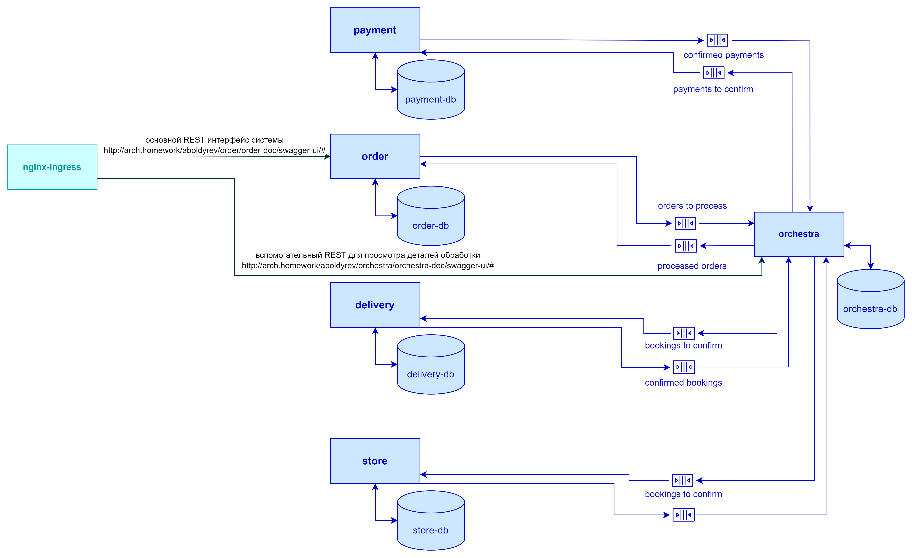
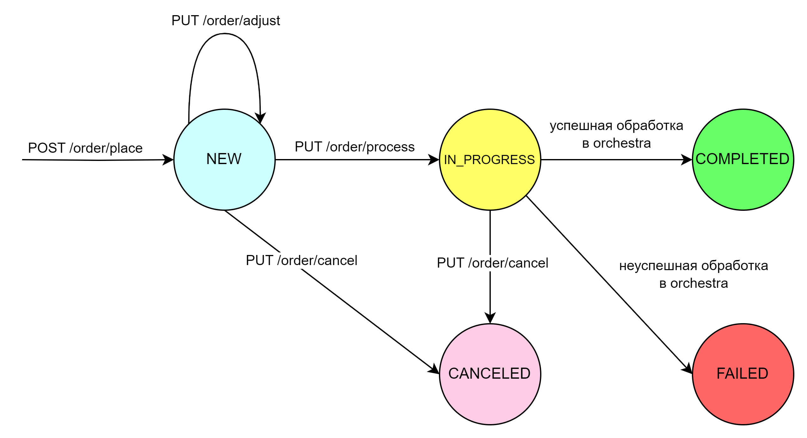
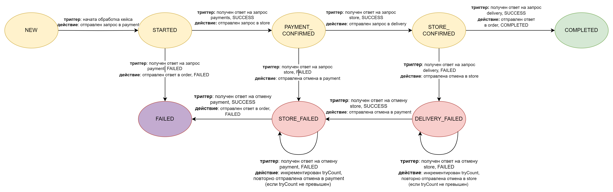
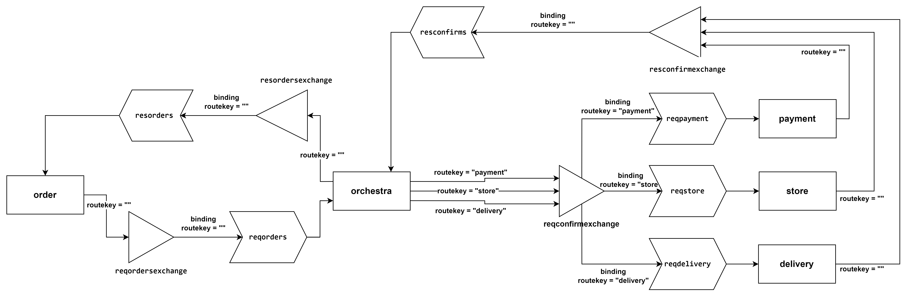

1. Общая информация

Проект представляет собой модель интернет-магазина и демонстрирует выполнение распределенной транзакции по паттерну "Сага с оркестрацией"

Схема компонентов:


Системы, участвующие во взаимодействии:

- order 
  
  система, создающая и дополняющая заказ в соответствии с действиями пользователя (ДЗ #6). 
  По команде PUT /process отдает заказ в обработку orchestra. 
  
  Swagger UI с описанием API после деплоя будет здесь:
  http://arch.homework/aboldyrev/order/order-doc/swagger-ui/#

  Статусная модель заказа в order выглядит так:
  
    
  
- orchestra 
 
  система-оркестратор распределенной транзакции. Модель статуса кейса обработки заказа по паттерну "Сага" представлена ниже:
  

  Имеет небольшой RestAPI для демонстрации работы.
  Swagger UI с описанием API после деплоя будет здесь:
  http://arch.homework/aboldyrev/orchestra/orchestra-doc/swagger-ui/# 	

- payment 
 
  эмулятор системы оплаты заказа. Получает запросы на подтверждение либо отмену оплаты заказа. 
  Поскольку это эмулятор, одобряет все запросы, кроме:
  первый символ orderId = 'p' - будет отвергнут запрос на подтверждение
  второй символ orderId = 'p' - будет отвергнут запрос на отмену 

- store
  
  эмулятор системы бронирования товара на складе. Получает запросы на подтверждение либо отмену бронирования. 
  Поскольку это эмулятор, одобряет все запросы, кроме:
  первый символ orderId = 's' - будет отвергнут запрос на подтверждение
  второй символ orderId = 's' - будет отвергнут запрос на отмену 
   
- delivery

  эмулятор системы управления доставкой товара. Получает запросы на подтверждение либо отмену доставки. 
  Поскольку это эмулятор, одобряет все запросы, кроме:
  первый символ orderId = 'd' - будет отвергнут запрос на подтверждение
  второй символ orderId = 'd' - будет отвергнут запрос на отмену 

Системы взаимодействуют через очереди RabbitMQ. Схема взаимодействия с указанием объектов RabbitMQ:


2. Установка проекта

Предпроверки

Убедитесь, что:
- nginx-ingress установлен и включен в кластере.
- доменное имя arch.homework роутится на хост, на котором установлен minikube.
- пути:
     - http://arch.homework/aboldyrev/*
   не используются другими сервисами.

Создаем и делаем дефолтным namespace learning

```
kubectl create ns learning

kubectl config set-context --current --namespace=learning

```

переходим в каталог helm/ и через устанавливаем чарты для БД Postgres, RabbitMQ и приложений:

```
helm install postgres ./postgres
```

устанавливает инстанцию БД и создает отдельные БД для каждого приложения

```
helm install rabbitmq ./rabbitmq
```
 
устанавливает брокер сообщений и создает необходимые приложению объекты (queues, exchange, bindings).
Развертывание занимает около минуты (есть ожидание инициализации для создания объектов)

```
helm install saga ./saga
```

через сабчарты устанавливает 5 описанных выше приложений. !!! Может быть ресурсоемко !!!. Поэтому в репозиторий добавил отдельные чарты для каждого приложения.

Их можно установить так (в любом порядке):

```
helm install order ./order

helm install orchestra ./orchestra

helm install payment ./payment

helm install store ./store

helm install delivery ./delivery
```


Удостоверьтесь, что все необходимые чарты установлены.

3. Инструкция по тестированию

Тестовая коллекция saga-tests.postman_collection.json находится в каталоге postman/

Перед началом необходимо выполнить первые 6 тест-кейсов:

- POST /order/product/post - create product beer
- GET /order/product/get - get product beer
- POST /order/product/post -create product fish
- GET /order/product/get - get product fish
- POST /order/product/post - create product chips
- GET /order/product/get - get product chips 

Эти кейсы выполняют создание и проверку наличия товарных позиций в справочнике продуктов order-db для последующих тестов.

Дальше кейсы сгруппированы по ожидаемому результату обработки:

- POST /order/place - создание заказа в order
- GET /order/get - получаем текущее состояние заказа в order
- PUT /order/process - передача заказа в обработку
- GET /orchestra/ordercase/get - получаем статус кейса обработки заказа из оркестратора 
- GET /orchestra/orderlog/get - получаем сообщения, сгенерированные оркестратором в процессе обработки кейса
- GET /order/get - получаем состояние заказа в order после завершения обработки (для "зависших" кейсов отсутствует).

Группы кейсов:

- успешно обработанная транзакция
- отказ на стадии payment
- отказ на стадии store, удачная отмена payment
- отказ на стадии delivery, удачная отмена store и payment
- отказ на стадии store, невозможно отменить payment, "зависший" кейс
- отказ на стадии delivery, удачная отмена store, невозможно отменить payment, "зависший" кейс
- отказ на стадии delivery, невозможно отменить store, "зависший" кейс.

Последние 3 группы "кейсов" имитируют "зависание" распределенной транзакции на одном из промежуточных статусов, когда выполнить 
отмену одной из уже совершенных стадий не удается. В production системе должны быть предусмотрены механизмы обработки подобных ситуаций.

4. Исходный код

Исходный код в каталоге src/

- src/order система заказов
- src/orchestra оркестратор "Саги"
- src/psd-app эмулятор payment, store, delivery 